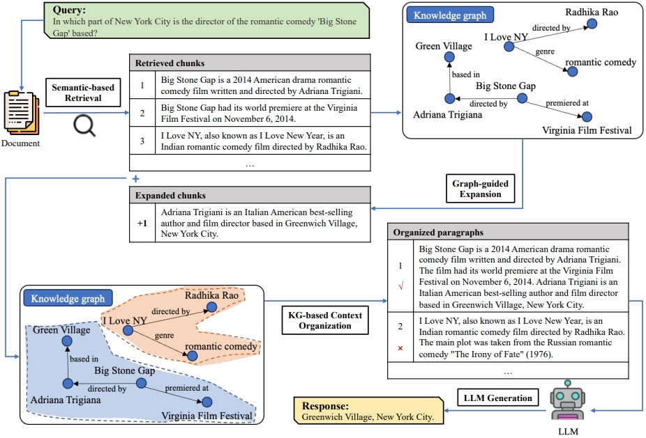

# Knowledge Graph-Guided Retrieval Augmented Generation
This is the official code release of the following paper:

Xiangrong Zhu, Yuexiang Xie, Yi Liu, Yaliang Li, Wei Hu. Knowledge Graph-Guided Retrieval Augmented Generation, NAACL 2025.

> Retrieval-augmented generation (RAG) has emerged as a promising technology for addressing hallucination issues in the responses generated by large language models (LLMs). Existing studies on RAG primarily focus on applying semantic-based approaches to retrieve isolated relevant chunks, which ignore their intrinsic relationships. In this paper, we propose a novel Knowledge Graph-Guided Retrieval Augmented Generation ($KG^2RAG$) framework that utilizes knowledge graphs (KGs) to provide fact-level relationships between chunks, improving the diversity and coherence of the retrieved results. Specifically, after performing a semantic-based retrieval to provide seed chunks, $KG^2RAG$ employs a KG-guided chunk expansion process and a KG-based chunk organization process to deliver relevant and important knowledge in well-organized paragraphs. Extensive experiments conducted on the HotpotQA dataset and its variants demonstrate the advantages of $KG^2RAG$ compared to existing RAG-based approaches, in terms of both response quality and retrieval quality.



## Quick Start

### Model Preparation
Please refer to the [model](model/readme.md) directory for instructions on downloading and setting up the required models.

### Data Preparation
Please refer to the [code/preprocess](code/preprocess/readme.md) directory for instructions on preparing the datasets.


### Run $KG^2RAG$
- To run in distractor setting:
  ```sh
  python kg_rag_distractor.py --dataset hotpotqa --data_path ../data/hotpotqa/hotpot_dev_distractor_v1.json --kg_dir ../data/hotpotqa/kgs/extract_subkgs --result_path ../output/hotpot/hotpot_dev_distractor_v1_kgrag.json
- To run in fullwiki setting:
  ```sh
  python kg_rag_full.py --dataset hotpotqa --data_path ../data/hotpotqa/hotpot_dev_distractor_v1.json --kg_dir ../data/hotpotqa/kgs/extract_subkgs --result_path ../output/hotpot/hotpot_dev_fullwiki_v1_kgrag.json
> If you have any difficulty or question in running code and reproducing experimental results, please email to xrzhu.nju@gmail.com.

## Citation
If you find the repository helpful, please cite the following paper.
```bibtex
@inproceedings{KG2RAG,
  title = {Knowledge Graph-Guided Retrieval Augmented Generation},
  author = {Zhu, Xiangrong and 
            Xie, Yuexiang and 
            Liu, Yi and 
            Li, Yaliang and 
            Hu, Wei},
  booktitle = {NAACL},
  year = {2025}
}
```
